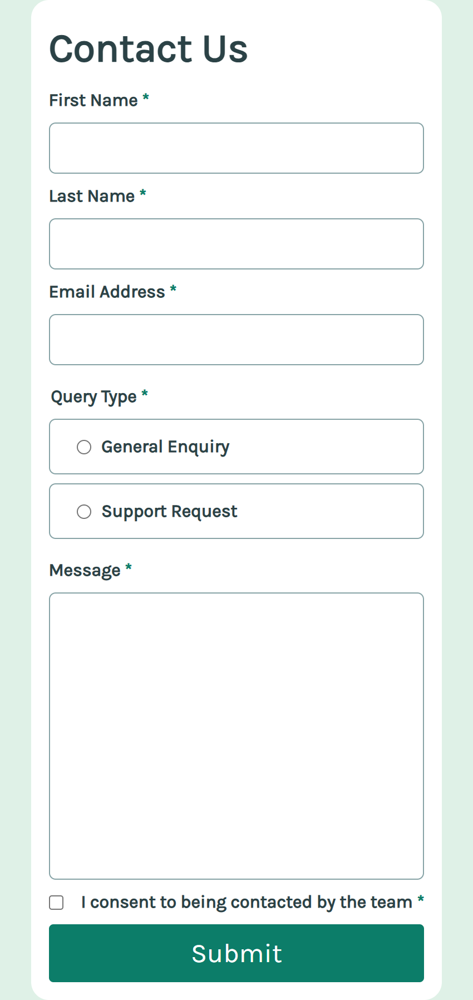
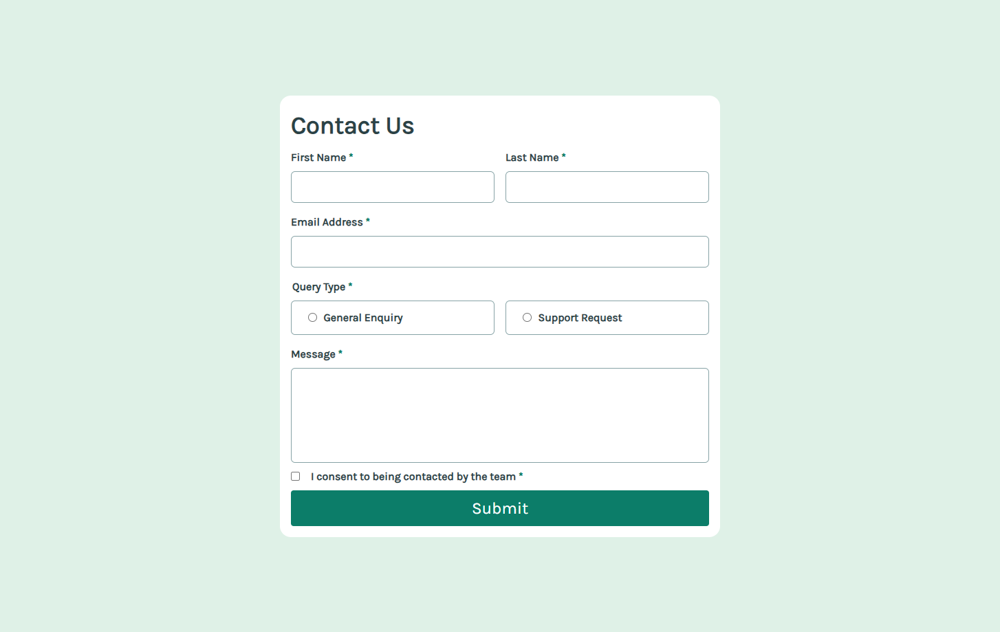
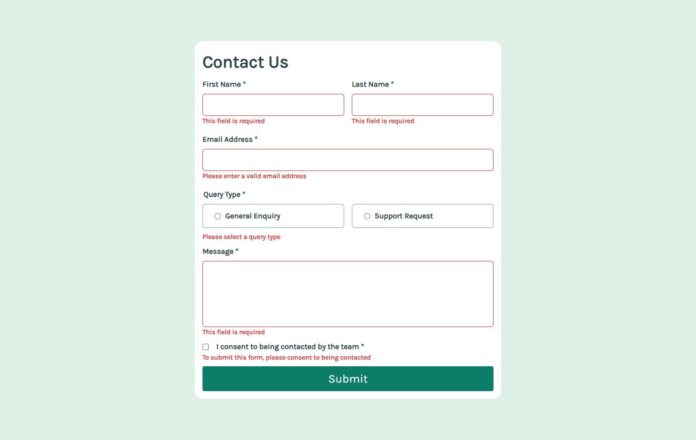
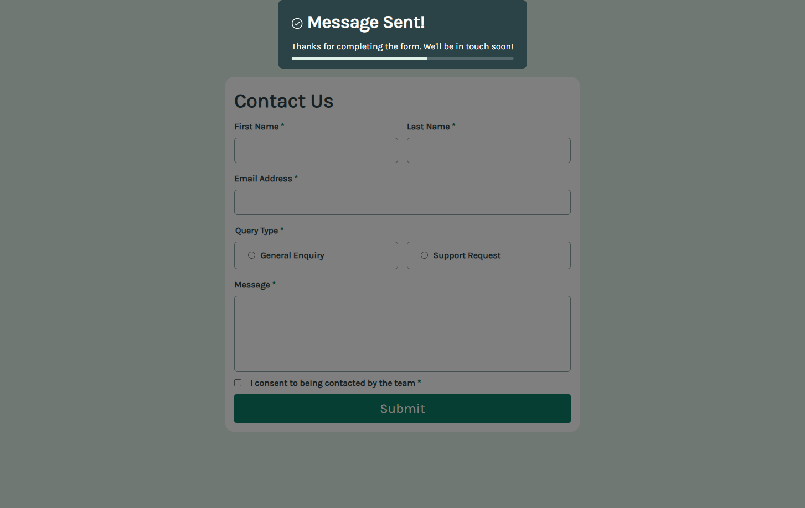

# Frontend Mentor - Contact form

This is a solution to the [Contact form on Frontend Mentor](https://www.frontendmentor.io/challenges/contact-form--G-hYlqKJj). Frontend Mentor challenges help you improve your coding skills by building realistic projects.

## Table of contents

- [Overview](#overview)
  - [The challenge](#the-challenge)
  - [Screenshot](#screenshot)
  - [Links](#links)
- [My process](#my-process)
  - [Built with](#built-with)
  - [What I learned](#what-i-learned)
  - [Useful resources](#useful-resources)
- [Author](#author)

## Overview

### The challenge

Users should be able to:

- Complete the form and see a **success toast/modal message** upon successful submission
- Receive **form validation messages** if:
- A required field has been missed
- The email address is not formatted correctly
- Complete the form **using only the keyboard**
- Have **inputs, error messages, and the success message announced** on their screen reader
- View the **optimal layout** for the interface depending on their device's screen size
- See **hover and focus states** for all interactive elements on the page

### Screenshot

<table>
  <tr>
    <th>Desktop View</th>
    <th>Mobile View</th>
  </tr>

  <!-- Row 1: Desktop header + Mobile image spanning all rows -->
  <tr>
    <td><strong>Desktop View</strong></td>
    <td rowspan="6"></td>
  </tr>

  <!-- Row 2: Desktop image -->
  <tr>
    <td></td>
  </tr>

  <!-- Row 3: Invalid Inputs header -->
  <tr>
    <td><strong>Invalid Inputs</strong></td>
  </tr>

  <!-- Row 4: Invalid input image -->
  <tr>
    <td></td>
  </tr>

  <!-- Row 5: Success header -->
  <tr>
    <td><strong>Success</strong></td>
  </tr>

  <!-- Row 6: Success image -->
  <tr>
    <td></td>
  </tr>
</table>

### Links

[Live Site URL](https://kapteynuniverse.github.io/Contact-form/)

[Solution URL](https://www.frontendmentor.io/solutions/contact-form-OHwjSgka7l)

## My process

### Built with

- Semantic HTML5 markup
- CSS custom properties
- Mobile-first workflow
- CSS Flexbox
- Vanilla JavaScript
- HTML `<dialog>` element for the modal
- Accessible ARIA attributes

### What I learned

While building this project, I improved my understanding of:

- **Form validation** using `FormData` and object-based validation
- **ARIA roles and accessible modals** with focus management
- **Progress animation** with CSS and JavaScript
- Structuring forms semantically with **fieldset** and **legend**
- Handling **radio buttons, checkboxes, and textareas** correctly
- Ensuring **keyboard accessibility** and screen reader compatibility

### Useful resources

- [MDN Web Docs - `<dialog>`](https://developer.mozilla.org/en-US/docs/Web/HTML/Element/dialog) – Helped me implement the modal with auto-close and progress bar
- [MDN Web Docs - The Form element](https://developer.mozilla.org/en-US/docs/Web/HTML/Element/form) – Reference for semantic form structure
- [MDN Web Docs - The Textarea element](https://developer.mozilla.org/en-US/docs/Web/HTML/Element/textarea) – Used for proper textarea accessibility
- [MDN Web Docs - FormData](https://developer.mozilla.org/en-US/docs/Web/API/FormData) – For collecting and validating form input values
- [MDN Web Docs - aria-haspopup attribute](https://developer.mozilla.org/en-US/docs/Web/Accessibility/ARIA/Attributes/aria-haspopup) – Understanding ARIA roles for modals

## Author

- Frontend Mentor - [Asilcan Toper](https://www.frontendmentor.io/profile/KapteynUniverse)
